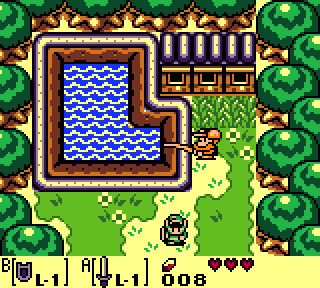

# Gaembuoy

A Game Boy (DMG) and Game Boy Color emulator written in C.



## Compiling and running

__Backup any save file you care about before you attempt to start the game in
Gaembuoy__. If there's a bug or format incompatibility it could lead to
save corruption. See the section about mappers and save files below for more
details.

The only dependencies are SDL2 and libpthread (for semaphores). If those
libraries are available on your system simply running `make` should build the
emulator.

You can then run the emulator by passing the ROM file on the command line:

```sh
./gaembuoy myrom.gb
```

The emulator will automatically detect the type of ROM (original Game Boy or
Game Boy Color) and start in the required mode.

## Philosophy, features and performance

This emulator is meant to be used as an introduction to emulator development, as
such the git history should be fairly clean and linear (no bugfix commits, small
changes in each commit etc...). The idea is to use this codebase as a support
to make a full blown tutorial.

Some optimizations were avoided in favor of simplicity and code readability.
This shouldn't be a problem on modern desktop computers since the Game Boy is
not an intensive console to emulate. To give a rough idea of the performance the
emulator uses about 10% of one CPU core while emulating The Legend of Zelda,
Oracle of Ages on my stock i5-4690K.

In order to keep the code simple and uncluttered some common emulator features
such as savestates and debugging support weren't implemented.

Serial link and IR emulation also haven't been implemented.

### Accuracy

Accuracy is good enough to emulate many (most?) GB and GBC games without major
glitches. There's still a lot of work to reach the level of accuracy of the best
emulators out there, especially for the SPU and GPU code.

### Mapper support and save files

The emulator currently supports MBC1, MBC2, MBC3 (with RTC) and MBC5. The more
exotic mappers (Game Boy Camera, rumble pack etc...) aren't supported.

If the game supports battery backup for RAM or RTC a save file will be used to
maintain the game state. By default the save file will be stored in the same
directory as the ROM file with the extension changed to `.sav`.

_Please be careful_, backup any valuable save files before you launch the
emulator, especially if they were made with an other emulator since it lead to a
corrupt and unusable save file.

In practice the save files generated by Gaembuoy should be compatible with most
other Game Boy emulator with the exception of MBC2 saves (used by Final Fantasy
Legend for instance) and MBC3 saves that contain an RTC (used by Pokemon Gold,
Silver and Crystal for instance). MBC2 saves *may* work in other emulators
depending on how they pack the 4bit values, MBC3 RTC saves almost certainly
won't work anywhere else since the RTC serialization format is completely
custom.

### Upscaling

By default the emulator outputs the native Game Boy resolution of 160x144
pixels. That can be very small on a modern monitor. If you want a quick and
dirty upscaling hack you can just cherry-pick the commit in the `dev/upscaling`
branch:

```sh
git cherry-pick dev/upscaling
```

You can change the scaling factor by changing the value of `UPSCALE_FACTOR` at
the top of `sdl.c`, by default it's set to 4 (i.e. each dimension is multiplied
by 4 for an effective resolution of 640x576).
